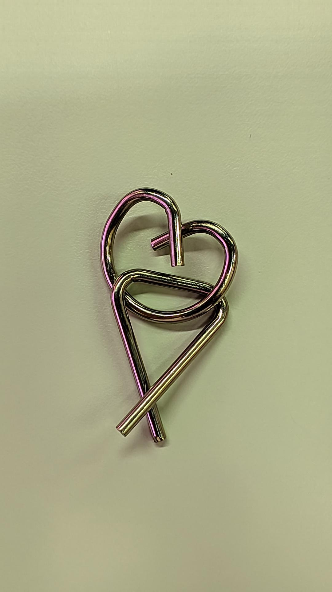
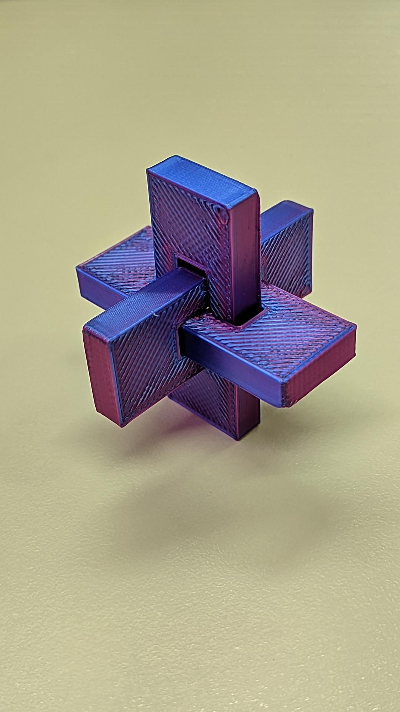
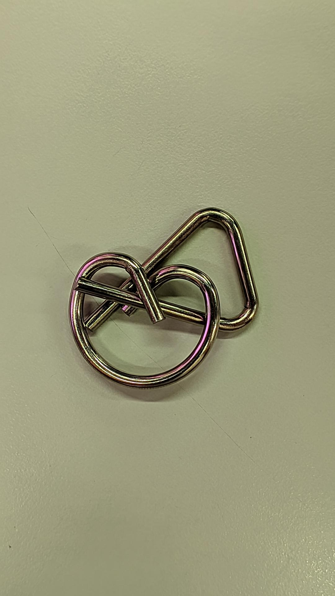
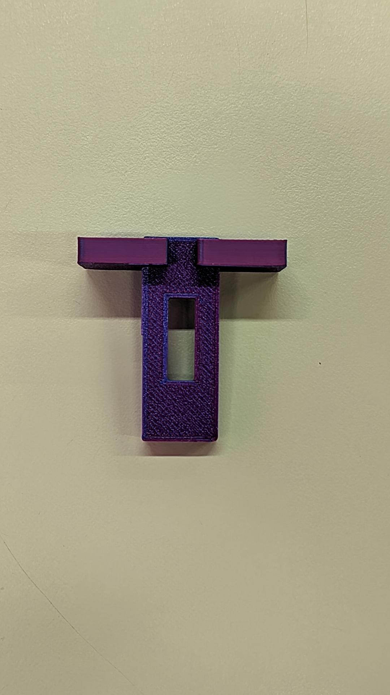
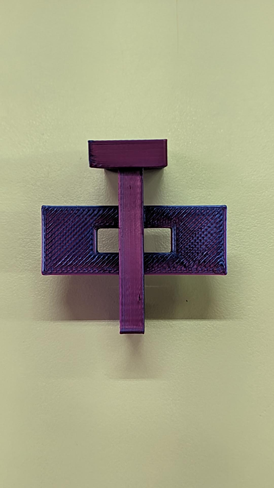
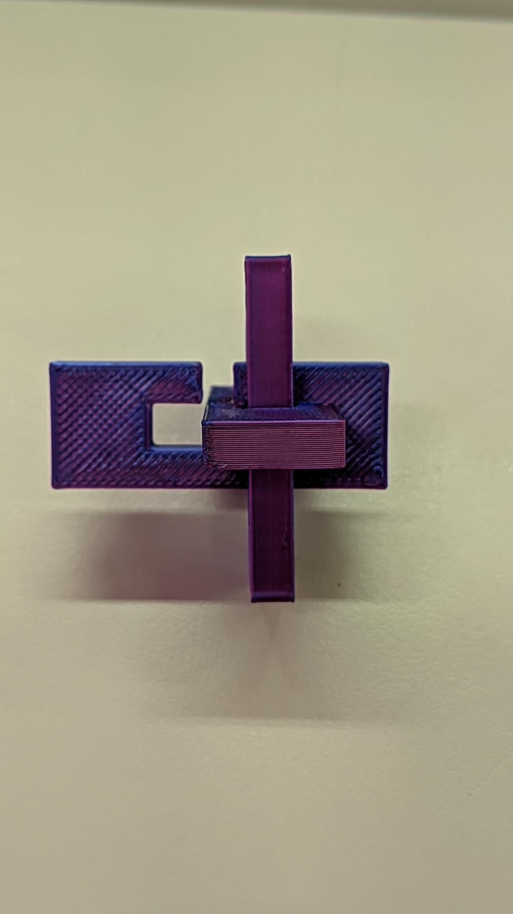

# Manual dos Quebras-Cabeças 

# Passo a Passo
# Quebra Cabeça 1
<h1>Passo 1:</h1>

<h3>Posicione as peças da forma a seguir,passando uma das "pernas" da peça por baixo da outra peça;
<h1>Passo 2:</h1>

<h3>Gire para frente até inverter a posição das "pernas";
<h1>Passo 3:</h1>

<h3>pronto puxe para trás que ele estará solto;

# Quebra Cabeça 2

<h1>Passo 1:</h1>

<h3>Coloque a peça 2 por dentro da 3(apenas uma parte);
<h1>Passo 2:</h1>

<h3>Em seguida coloque a peça 1 por dentro da 2;
<h1>Passo 3:</h1>

<h3>Depois desça a peça 3 dentro da peça 1;
<h1>Passo 4:</h1>

<h3>Para finalizar, empurre a peça 1 até ficar centralizado com com a 2, tampando a abertra que tem na 1;

# FIM

### Colaboradores:
Gabriel Silva Carreira \
Angelo Gabriel Cuerba \
Lucas Gabriel Santos Silva \
Kauã Carvalho 

